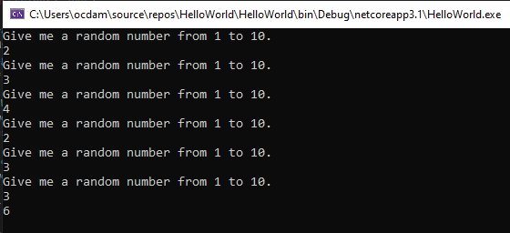
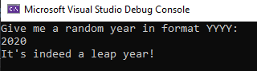
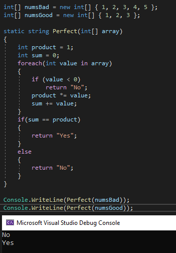
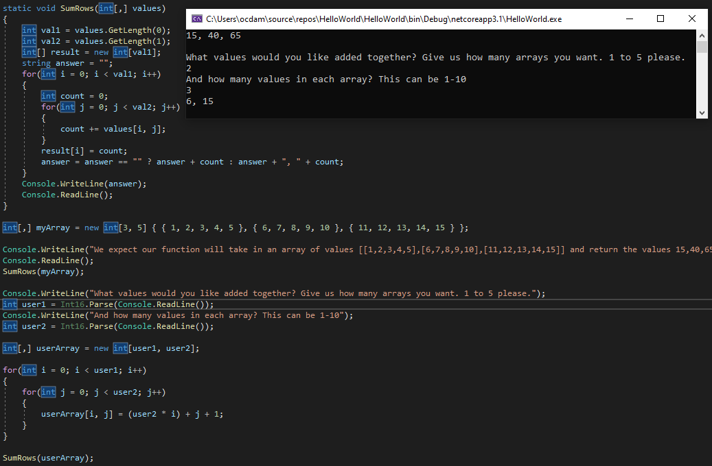

# DSA-CSharp
Data structures and algorithms to be written in C#.

## Array Max Result
### Given an array select a number that exists, and output the computated "score". The method you create should take in both an array of integers and the integer the user selected.
### Create a Console application that requests 5 numbers between 1-10 from the user. Output the array to the console and ask the user to select a number. After the selection, output the "score" of the number chosen.

Working solution gave this output:

## Leap Year Calculator
### Given a year, report if it is a leap year.

Working solution gave this output:

## Perfect Sequence
### Given an array, check if it's a perfect sequence. A perfect sequence is when the numbers given have the same product as their sum, and there are no negative values.
### A valid perfect sequence should return "Yes", while invalid should return "No".

Working solution gave this output:

## Sum Of Rows
### Given a matrix of integers. Return the sum of each row in a single dimensional array.

Working solution gave this output:

